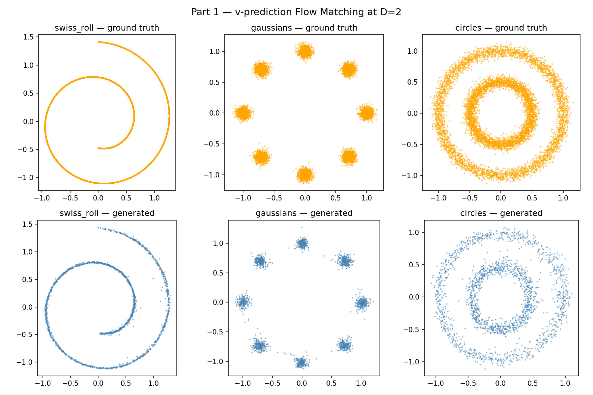
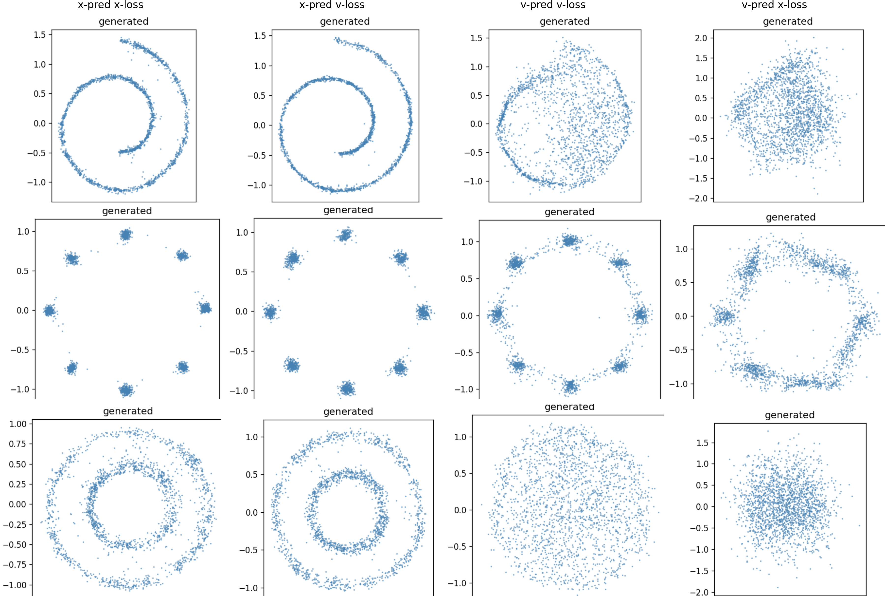
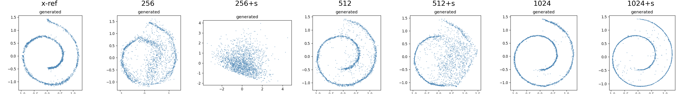
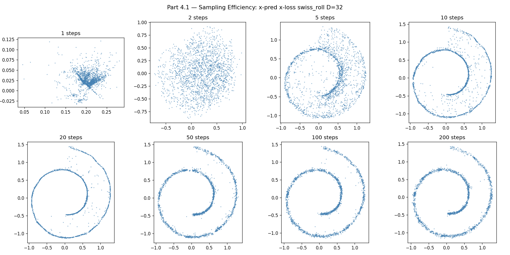
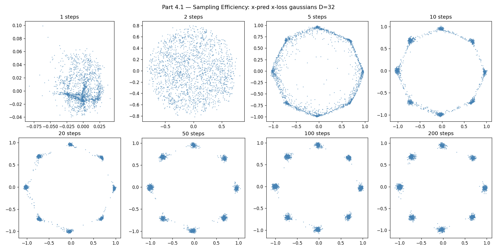
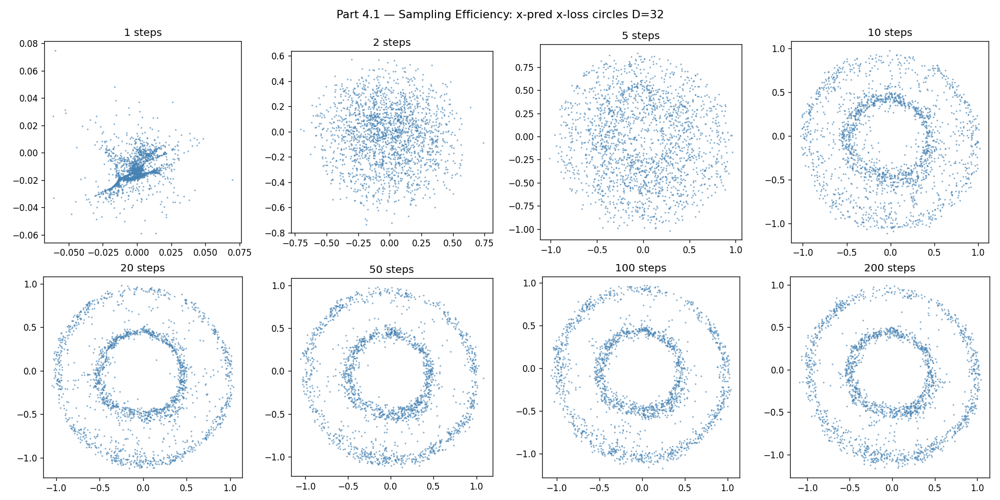
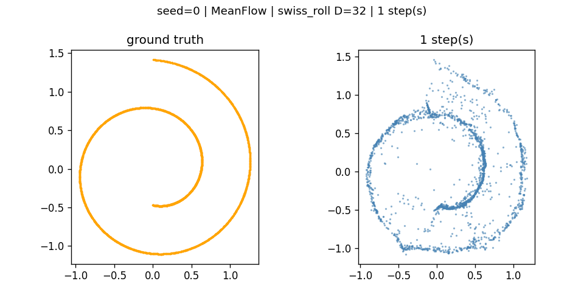
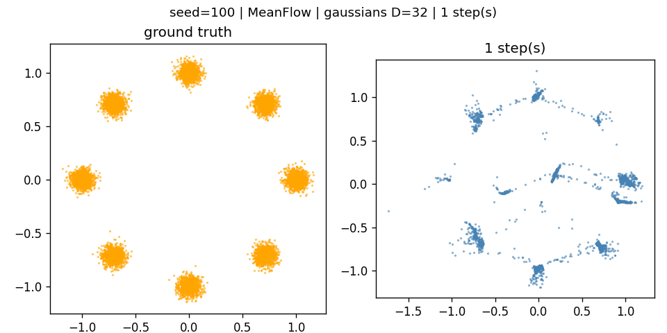
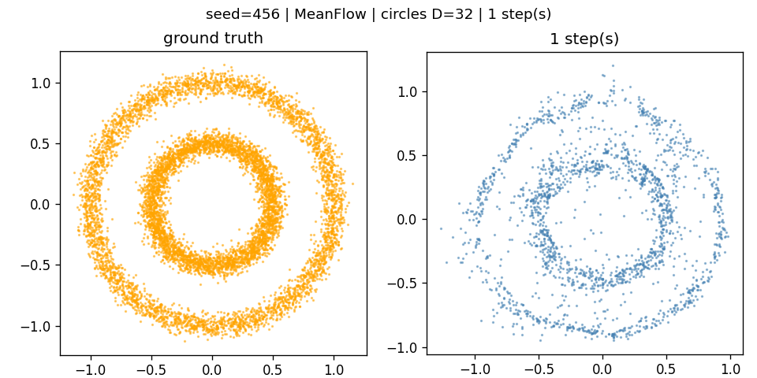

# Flow Matching Parameterisation

**COMP4680/ENGN8650 Mini-Project 2** — Mayukh Das (U7965027), ANU

A neural network learns to transform random noise into structured data by predicting a velocity field that "flows" samples along learned trajectories. This project explores how different ways of parameterising that prediction affect quality, stability, and efficiency — from 2D toy distributions all the way to one-step generation with [MeanFlow](https://arxiv.org/abs/2505.13447).

---

## Part 1: Learning to Generate 2D Shapes

A small MLP is trained to generate three toy datasets (swiss roll, gaussians, circles) by learning a velocity field that pushes Gaussian noise toward each target distribution.

<p align="center">
  
</p>

> **Top row:** ground truth distributions. **Bottom row:** generated samples from the trained model. At D=2, v-prediction recovers all three cleanly.

---

## Part 2: x-prediction vs v-prediction

What happens when we scale the ambient dimension to D=32? We test all 4 combinations of prediction target (x vs v) and loss function (x vs v) across three dimensions.

<p align="center">
  
</p>

> **At D=32, v-prediction fails catastrophically** while x-prediction remains stable. The columns show different prediction/loss combos; the rows show datasets. x-prediction (left two columns) produces clean structure, while v-prediction (right two columns) collapses into noise.

| Configuration | D=2 | D=8 | D=32 |
|:---|:---:|:---:|:---:|
| x-pred + x-loss | good | good | good |
| x-pred + v-loss | good | good | good |
| v-pred + x-loss | good | degrades | fails |
| v-pred + v-loss | good | degrades slightly | fails |

**Why?** x-prediction only needs to learn the low-dimensional structure of the data (always 2D), while v-prediction must model a target that scales with the full ambient dimension.

---

## Part 3: Rescuing v-prediction

Can we save v-prediction by giving it more capacity? We sweep network width h in {256, 512, 1024} with both default and shifted noise schedules.

<p align="center">
  
</p>

> **Only widening to h=1024 rescues v-prediction.** The shifted schedule alone doesn't help. This comes at ~16x the compute cost of the baseline x-prediction model (330K vs 5.2M parameters).

---

## Part 4.1: How Many Sampling Steps Do You Need?

Using the best configuration (x-pred + x-loss, D=32), we evaluate sample quality across Euler step counts from 1 to 200.

<p align="center">
  
</p>
<p align="center">
  
</p>
<p align="center">
  
</p>

> Structure emerges at ~10 steps and largely saturates by 20-50. Beyond 50 steps, improvements are marginal. This establishes the baseline for MeanFlow's one-step generation.

---

## Part 4.2: MeanFlow — One-Step Generation

MeanFlow learns the *average velocity* over trajectory intervals using Jacobian-vector products, enabling generation in a single forward pass.

<p align="center">
  
</p>
<p align="center">
  
</p>
<p align="center">
  
</p>

> **One-step MeanFlow results.** Swiss roll and circles are recovered cleanly. Gaussians show mode concentration — a structural artifact of averaging velocity across multi-modal distributions.

---

## Running

```bash
uv sync            # install dependencies from pyproject.toml
python part1.py
python part2.py
python part3.py
python part4.1.py
python part4.2.py
```

Each script trains from scratch and saves figures to `figures/`. Parts 1-3 train for 25,000 steps; Part 4 trains for 50,000 steps. All use a 5-layer MLP with 256 hidden units (except Part 3 which sweeps width).

## Report

The full writeup with analysis is in [`u7965027_MiniProject2_Flow_Matching.pdf`](u7965027_MiniProject2_Flow_Matching.pdf).

## References

- [Back to Basics (JiT)](https://arxiv.org/abs/2511.13720) — prediction parameterization in flow matching
- [RAE](https://arxiv.org/abs/2510.11690) — parameterization and dimension
- [MeanFlow](https://arxiv.org/abs/2505.13447) — one-step generation via averaged velocity fields
